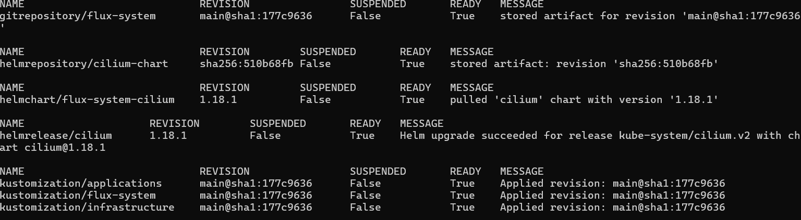

# Setting Up FluxCD and K8s Infrastructure Part I"

## Jumphost Script
As I was preparing for this blog I realized that my tools where starting to become dated.  To fix that and to be able to quickly build my jumphost I built an Ansible playbook to update and deploy all the tools.  

You can find it here:

https://github.com/TheR3dC0rner/infrascripts/blob/main/jumpbox_tools.yaml
## Bootstrapping Flux

Flux is a continues deployment platform designed to keep the configuration of our apps and cluster in git.  This acts as a source of truth and helps prevent drift since its always reconciling against the configuration.   
We are going to use the k8sclusters we defined earlier.  To do this on our jumpbox we are going to have to init our repo and create a readme and then push it. 

You would do something like this
```shell
touch README.md
git init
git checkout -b main
git add README.md
git commit -m "first commit"
git remote add origin git@gitssh.dev.th3redc0rner.com:RedCorner/k8sclusters.git
git push -u origin main
```


We are going to use the separate ssh key we had setup earlier to bootstrap the cluster. 

To bootstrap the cluster we perform something similiar to the bootstrap command below.

```shell
flux bootstrap git --url=ssh://git@gitssh.dev.th3redc0rner.com/RedCorner/k8sclusters.git --branch=main --private-key-file=/home/a
dmin1/.ssh/admin1_flux_ed25519_key --path=clusters/staging
```

The clusters directory will define where each clusters flux configuration goes.   As defined this is our staging cluster.

If all is successful you should receive something similar to this:

```
► cloning branch "main" from Git repository "ssh://git@gitssh.dev.th3redc0rner.com/RedCorner/k8sclusters.git"
✔ cloned repository
► generating component manifests
✔ generated component manifests
✔ committed component manifests to "main" ("d5d62aa0bc43a47447a002b64a328f25329819ce")
► pushing component manifests to "ssh://git@gitssh.dev.th3redc0rner.com/RedCorner/k8sclusters.git"
► installing components in "flux-system" namespace
✔ installed components
✔ reconciled components
► determining if source secret "flux-system/flux-system" exists
► generating source secret
✔ public key: ssh-ed25519 AAAAC3NzaC1lZDI1NTE5AAAAINdeySpnExcwoQUFwO2G4CYsnCk2wriK2bsqF1Ql5V47
Please give the key access to your repository: y
► applying source secret "flux-system/flux-system"
```

You can the validate it by running:

```shell
flux get all

```

If its working correctly you should get something similar  to this:

```
NAME                            REVISION                SUSPENDED       READY   MESSAGE
gitrepository/flux-system       main@sha1:b0e86381      False           True    stored artifact for revision 'main@sha1:b0e86381'

NAME                            REVISION                SUSPENDED       READY   MESSAGE
kustomization/flux-system       main@sha1:b0e86381      False           True    Applied revision: main@sha1:b0e86381
```
You can also validate the pods are running correctly by running
```shell
kubectl get pods -n flux-system
```
The output should look like this
```
NAME                                       READY   STATUS    RESTARTS   AGE
helm-controller-5c898f4887-44mgx           1/1     Running   0          6m56s
kustomize-controller-7bcf986f97-76jwm      1/1     Running   0          6m56s
notification-controller-5f66f99d4d-mdxd8   1/1     Running   0          6m56s
source-controller-54bc45dc6-pftjn          1/1     Running   0          6m56s
```

## Creating our encryption keys
The next step is to give the capacities to store secrets encrypted.  This will alllow us to securly store kubernetes secrets in a secure format when being placed in the git repo.  When we setup the jump host we installed sops and age.  These 2 tools together will allow us to encrypt our secrets.  

Mozilla SOPS (Secret OPerationS) is an inline editor for encrypted files that supports multiple formats including YAML and JSON.  

"age" is a simple, modern secure tool for encrypting files.  It is a direct replacement for PGP (Pretty Good Privacy)

Flux controller can decrypt SOPS encrypted YAML using a provided key.  


To to this we have to generate our keys but we don't want to create it in our git repo. 

```shell
mkdir ../agekeys

age-keygen -o ../agekys/age.agekey

```

One should create a secret with the age private key, the key name must end with `.agekey` to be detected as an age key:

```shell
cat age.agekey |
kubectl create secret generic sops-age \
--namespace=flux-system \
--from-file=age.agekey=/dev/stdin
```

## Defining our cluster layout

We are going to define our repo as a what flux describes a mono repo.  In a monorepo approach you would store all your Kubernetes manifests in a single Git repository. The various environments specific configs are all stored in the same branch (e.g. `main`).  

We will store our exercises/c2 configuration in a separate repo to give different permissions and seperation from the main infrastructure.  

For now we are going to define the current infrastructure side and show how we can template it out for when we setup the production cluster later.

Flux depends upon kustomize, which is a form of templating for kubernetes.

[Kustomize](https://github.com/kubernetes-sigs/kustomize) is a standalone tool to customize Kubernetes objects through a [kustomization file](https://kubectl.docs.kubernetes.io/references/kustomize/glossary/#kustomization).  This has been supported natively by Kubernetes since version 1.14.

We are going to start by defining the layout of our cluster.

It's going to look something similar to this:
```console
├── apps
│   ├── base
│   ├── production 
│   └── staging
├── infrastructure
│   ├── base
│   ├── production 
│   └── staging
└── clusters
    ├── production
    └── staging
```

In our staging directory  under the clusters directory we will create 2 files,  one defining the location of infrastructure applications and the other for general applications.

The infrastructure.yaml file will look like this:

```console
apiVersion: kustomize.toolkit.fluxcd.io/v1
kind: Kustomization
metadata:
  name: infrastructure
  namespace: flux-system
spec:
  interval: 10m0s
  sourceRef:
    kind: GitRepository
    name: flux-system
  path: ./infrastructure/staging
  prune: true
  # Enable decryption
  decryption:
    # Use the sops provider
    provider: sops
    secretRef:
      # Reference the new 'sops-gpg' secret
      name: sops-age

```

The applications.yaml file would look like this:

```console
apiVersion: kustomize.toolkit.fluxcd.io/v1
kind: Kustomization
metadata:
  name: applications
  namespace: flux-system
spec:
  interval: 10m0s
  sourceRef:
    kind: GitRepository
    name: flux-system
  path: ./apps/staging
  prune: true
    # Enable decryption
  decryption:
    # Use the sops provider
    provider: sops
    secretRef:
      # Reference the new 'sops-gpg' secret
      name: sops-age
```

Now starting at the root of the repo perform:

```shell
mkdir -p infrastructure/{base,staging}
mkdir -p apps/{base,staging}
```

To make sure things are working we are first going to put a readme.txt in each folder
```
touch infrastructure/staging/README.md
touch apps/staging/README.md
```

From the root of the repo peform a commit:

```shell
git add .
git commit -m "setting up directory tree"
git push
```

After about 5 minutes you can try to see if everything is working properly:

```
flux get all
```

It will look something similar to this (everything should say ready):
![Output][images/20250814214725.png]
## Setting Up the Base Overlay

In our infrastructure directory we are going to setup our base overlays.   What we are defining is both how staging and production will be setup.  The idea is that environments should be the same except minor changes directly related to the environments.  For instance staging might be running at v1.2 of an application and production at v1.1 until we have vetted it enough to upgrade production.  Also means if we make any changes inthe base and no changes in either resource, it would be pushed down to both resources allowing us to only define the items once.

We are going to be combining kustomize with helm to achieve this.  Helm is basically the package management solution for Kubernetes.  Its essentially the k8s version of apt but unlike apt, each package has its own configuration that can be setup when deployed.  Kustomize is a built in templating language for Kubernetes.  

The first item we ware going to control is our resources.  This is going to define where we get our helm packages from.  In our base directory lets create our resources directory.

```
mkdir infrastructure/base/resources/
```

The first item we want to setup for now is to put management on our networking.  Since Cilium is setup for the bare minimum we want to add all its features, plus if networking breaks before anything else this will be hard to trouble shoot.  

In FluxCD HelmRepository files tell the sources where to get the packages from.  This would very similar to the PPA in the ubuntu world. 

We are going to create the file cilium-helm.yaml in the new resources directory:

```console
---
apiVersion: source.toolkit.fluxcd.io/v1beta2
kind: HelmRepository
metadata:
  name: cilium
  namespace: flux-system
spec:
  interval: 1m10s
  url: https://helm.cilium.io/
```


Then create a kustomization.yaml file for this resource:

```console
apiVersion: kustomize.config.k8s.io/v1beta1
kind: Kustomization
resources:
  - cilium-helm.yaml
```

The kustomization.yaml tells flux what to load.  We haven't actually told it to load this though since the cluster is looking for the initial kustomize file in infrastructure/staging/

In the infrastructure/base folder we are going to create a cilium.yaml file to tell flux how to load the cilium package into our cluster.

Following this we are going to create a cilium directory under our infrastructure/base directory.

```console
mkdir infrasturcutre/base/cilium
```

Now we are going setup the files to load cilium and what features to enable.  The first file we need is the helmrelease.yaml.  Helm releases in FluxCD tell flux what package to load and where to place it in the cluster (namespace).  In this case we are going to place it in the kube-system namespace which is the core systems space for all of Kubernetes.

```console
apiVersion: helm.toolkit.fluxcd.io/v2beta1
kind: HelmRelease
metadata:
  name: cilium
  namespace: flux-system
spec:
  chart:
    spec:
      chart: cilium
      reconcileStrategy: ChartVersion
      sourceRef:
        kind: HelmRepository
        name: cilium-chart
  interval: 5m50s
  releaseName: cilium
  targetNamespace: kube-system
  valuesFrom:
    - kind: ConfigMap
      name: cilium-values
```


Helm configures itself with a values file.  Our values are going to stored in cilium-values.yaml

```console
kubeProxyReplacement: "true"
nodeIPAM:
  # -- Configure Node IPAM
  # ref: https://docs.cilium.io/en/stable/network/node-ipam/
  enabled: true

encryption:
  # -- Enable transparent network encryption.
  enabled: true
  # -- Encryption method. Can be either ipsec or wireguard.
  type: wireguard

defaultLBServiceIPAM: nodeipam

```

Node IPAM LoadBalancer  of Cilium is a feature inspired by k3s “ServiceLB” that allows you to “advertise” the node’s IPs directly inside a Service LoadBalancer.

The encryption feature of  Cilium encrypts all traffic between nodes.  

Setting the default load balancer as nodeipam means we don't have to define it in our service.yaml files.

Next we are going to create the kustomization.yaml file which will load cilium once we activate in our staging directory.  

kustomization.yaml 

```console
kind: Kustomization
namespace: flux-system
resources:
  - helmrelease.yaml
configMapGenerator:
  - name: cilium-values
    files:
      - values.yaml=cilium-values.yaml
configurations:
  - kustomizeconfig.yaml
```

If you notice we define that we are going to use cilium-values as our values files and the rules for configure that file will be in kustomizeconfig.yaml


kustomizeconfig.yaml:

```console
nameReference:
- kind: ConfigMap
  version: v1
  fieldSpecs:
  - path: spec/valuesFrom/name
    kind: HelmRelease
```

This is essentially a patch to tell Kustomize to make the configmap name with a unique identifier every time its generated.  

To complete this initial load from our base we have to create another kustomization.yaml file in 

```
infrastructure/base/kustomization.yaml
```
``

This will load each defined directory.  Kustomize basically recurisvly loads packages from kustomization.yaml files.  This file will look like this:

```console
apiVersion: kustomize.config.k8s.io/v1beta1
kind: Kustomization
resources:
  - resources
  - cilium
```

Its telling the cluster we will load our objects from the resource directory and the cilium directory:

## Deploying The Updated Cilium

We can now setup cilium in our actual staging directory to load into the cluster with our new features.  The cluster is looking for our kustomization files in the infrastructure/staging folder and no the base.  The advantage of creating this base is that we can now load identical instances in multiple clusters by referencing.  Which in the long run we plan to do when deploying a production cluster.  We can also make changes based on the cluster if needed.

We are now going to create its kustomization.yaml file:

```
infrastructure/staging/kustomization.yaml

```


```console
apiVersion: kustomize.config.k8s.io/v1beta1
kind: Kustomization
resources:
  - ../base
patches:
  - path: cilium/cilium-patches.yaml
    target:
      kind: HelmRelease
      name: cilium
   
```
This will load our base as defined and the we are going to make changes to that base.  In this case we going to fix the version of cilium being loaded.  This is so we can control when we update.  Fluxcd will automatically grab the latest version, but this could cause harm to environment without testing.  So by controlling the version we can set the version in staging.  If it appears to work we can make the same changes in production once its rolled out.  

we will now make a cilium directory

```
mkdir infrastructure/staging/cilium/
```

In this directory we will create the cilium-patches.yaml we defined above:

```
apiVersion: helm.toolkit.fluxcd.io/v2beta1
kind: HelmRelease
metadata:
  name: cilium
  namespace: flux-system
spec:
  chart:
    spec:
      chart: cilium
      version: "1.18.1"
```

Before we commit everything we can verify there should not be any errors staging directory
```
infrastructure/staging
```

We can run the command

```
kustomize build
```


This should spit out a lot of yaml and no errors.  This most likely means everything is clean.

At this point our full tree layout of infrastructure should look like this:

```
├── README.md
├── apps
│   ├── base
│   └── staging
│       ├── README.md
│       ├── kustomization.yaml
│       └── testnamespace.yaml
├── clusters
│   └── staging
│       ├── applications.yaml
│       ├── flux-system
│       │   ├── gotk-components.yaml
│       │   ├── gotk-sync.yaml
│       │   └── kustomization.yaml
│       └── infrastructure.yaml
└── infrastructure
    ├── base
    │   ├── cilium
    │   │   ├── cilium-values.yaml
    │   │   ├── helmrelease.yaml
    │   │   ├── kustomization.yaml
    │   │   └── kustomizeconfig.yaml
    │   ├── kustomization.yaml
    │   └── resources
    │       ├── cilium-chart.yaml
    │       └── kustomization.yaml
    └── staging
        ├── README.md
        ├── cilium
        │   └── cilium-patches.yaml
        └── kustomization.yaml
```
To actually apply this to our cluster we are going to perform from our infrastructure directory:

```shell
git add .
git commit -m "adding cilium changes"
git push
```

Wait about 5 minutes for flux to get its resources or can for it reconcile immediately with:

```shell
flux reconcile source git flux-system
```

Then run the command:

```shell
flux get all
```

If everything is correct you should see that everything is marked as ready.




Run the command:

```shell
cilium encryption status
```

We should get the output:

```
Encryption: Wireguard (3/3 nodes)
```

Now we ensure the ipam load balancer was loaded:

```shell
cilium config view | grep ipam
```

We should get out like this:

```
default-lb-service-ipam                           nodeipam
enable-lb-ipam                                    true
enable-node-ipam                                  true
ipam                                              cluster-pool
ipam-cilium-node-update-rate                      15s
```

We do have to restart cilium to have its changes fully applied:

```shell
kubectl -n kube-system rollout restart deployment/cilium-operator
```

Finally to test our services are loading correctly lets make a dummy service in a file called test_service.yaml

```console
apiVersion: v1
kind: Service
metadata:
  name: service-blue
  namespace: default
  labels:
    color: blue
spec:
  type: LoadBalancer
  ports:
  - port: 1234

```
Apply this temporarily to our cluster

```shell
kubectl apply -f test_service.yaml
```

Then run:

```shell
kubectl get services
```

If it was successful you should have your ips listed as the external ips:


Now remove this test service

```
kubectl delete service service-blue
```

We have covered a lot in this blog so in Part II we will follow this pattern and load the rest of crucial services for infrastructure.

After that we can start building are actual C2 images.  We will come back to the applications base when we actually start to stand up C2's


