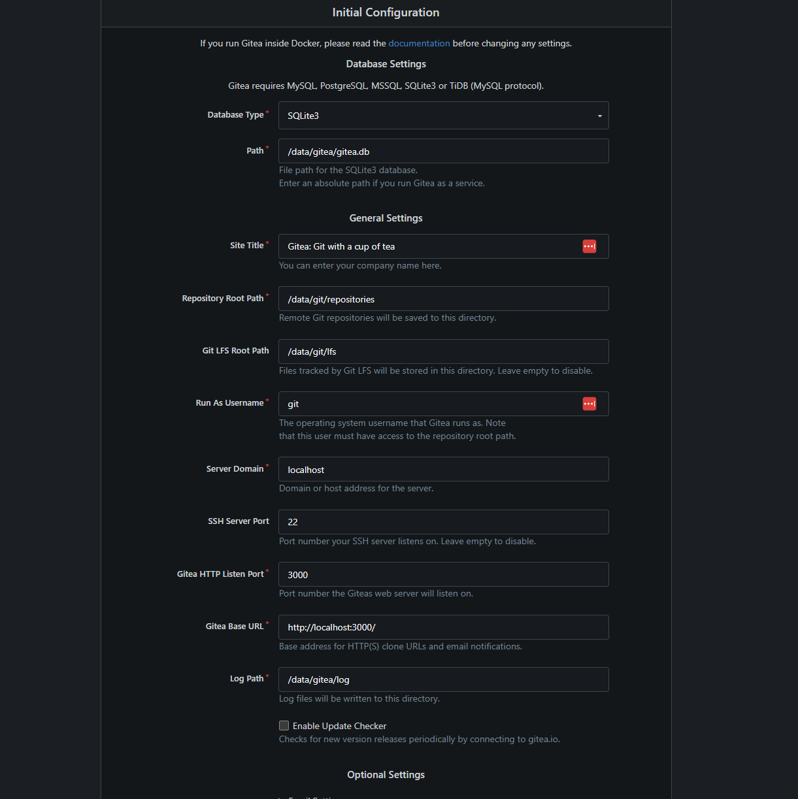
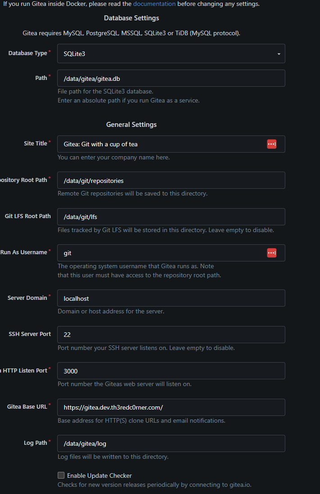
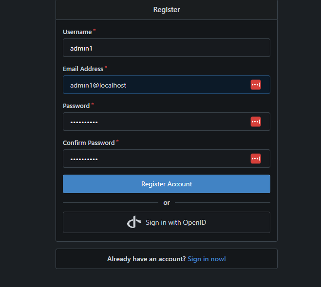

This will walk through the basic install of Gitea and creating our admin account.  The second part will be setting up organizations and roles.  We will use the roles setup in that part to control deployments to the the Kubernetes cluster.

Which also brings up why we're using Docker if we’re going to use Kubernetes later.  I have always been a firm believer that the supporting infrastructure should be in place first. If you put everything in the Kubernetes cluster and it goes down, you're stuck.  You  would need to get the cluster up and Gitea  running just to rebuild the cluster but the cluster needs to pull resources from a git repo to rebuild properly.  This would  end up being messy and difficult.  Separating this infrastructure allows us to restore the supporting infrastructure components through good backups.   

I gave this machine a bit more resources. They are as follows: 
```
2 cpus
50gb drive 
8 gb of ram
```

Now let's begin going through our setup.  

We will start by using our playbook to deploy docker to our Gitea server from our jumphost.

```css
ansible-playboook install_docker.yaml -i 192.168.200.249, -u admin1
```

Once we have logged in we are going to create a directory for gitea:
```bash
mkdir gitea
cd gitea
```


Now create our docker-compose.yaml
```yaml
networks:
  gitea:
    external: false

services:
  gitea-server:
    image: docker.gitea.com/gitea:1.24.0
    container_name: gitea
    environment:
      - USER_UID=1000
      - USER_GID=1000
    restart: always
    networks:
      - gitea
    volumes:
      - ./data:/data
      - /etc/timezone:/etc/timezone:ro
      - /etc/localtime:/etc/localtime:ro
    ports:
      - "3000:3000"
      - "22:22"
```


This is going to run Gitea on port 22.  I found that flux really does not like to operate with a git resource on an ssh port other then port 22.  Before we use docker to start our container we have to reconfigure ssh.

To change ssh to listen on another port you have to edit


`/etc/ssh/sshd_config`


Once you are editing the file your are going to add a single line
```yaml
Port 2222
```

Then restart the SSH server and SSH should be running on port 2222.

```bash
systemctl restart ssh
```

Of course you have to reconnect to the box now that the SSH port has changed

Now we can safely start the Gitea server. Go back into the directory that we created earlier with the docker compose file and start the server

```bash
docker compose up -d
```

The problem we will face now is that we can not reach the server from our main network since we have not setup the reverse proxy since in my setup the only ports allowed into that VLAN are port 22 to the gitea server and port 443 the proxy server.  

 Now we SSH to the proxy server and are going to add the Gitea server to our proxy server.  If you have been following along you should already have an entry in the Caddyfile for our identity manager.  The full config file of Caddyfile should now look similar to this:

```css
#admin1@dproxy:~/caddy$ cat Caddyfile
#{
#        admin 0.0.0.0:2019
#}

*.dev.th3redc0rner.com {
        tls {
                dns cloudflare {env.CF_API_TOKEN}
                propagation_delay 2m
                resolvers 1.1.1.1
        }


        @identity host identity.dev.th3redc0rner.com
        handle @identity {
                reverse_proxy 192.168.201.75:1411
        }

        @gitea host gitea.dev.th3redc0rner.com
        handle @gitea {
                reverse_proxy 192.168.200.249:3000

        }
     }
```

Restart Caddy on reverse proxy to reload the config

```bash
docker compose stop
docker compose up -d
```

If everything has gone correctly you should be able to browse to your gitea server with ssl.

You will be greeted with a similar screen:


We are going to modify some of these settings




Once changed click install


Now you want to click the "Register" button on top.  This will create the initial admin account.




Now go back and sign in with your admin account and make sure it works.

I found I need to make some additional changes for gitea to work for ssh.  Since the reverse proxy is handing the IP for the Gitea I need to make a separate dns entry for the ssh. 

On the dns server I need another entry just for ssh.  My DNS file now looks like this.

```console
192.168.200.226 identity.dev.th3redc0rner.com
192.168.200.226 gitea.dev.thi4redc0rner.com
192.168.200.249 gitssh.dev.th3redc0rner.com    

```


Once I had did this, I went back the Gitea server and made some additonal changes to its config file.

I edited the following file:
`~/gitea/data/gitea/conf/app.ini`

I then changed the following in that file to match our dns server:


```console
[server]
APP_DATA_PATH = /data/gitea
DOMAIN = gitea.dev.th3redc0rner.com
SSH_DOMAIN = gitssh.dev.th3redc0rner.com
HTTP_PORT = 3000
ROOT_URL = https://gitea.dev.th3redc0rner.com/
DISABLE_SSH = false
SSH_PORT = 22
SSH_LISTEN_PORT = 22
```


After editing that file one has to restart Gitea.

```bash
docker compose down
docker compose up
```

Next blog we will work on connecting Gitea to our identity manager for passwordless login and  setup our organization.
