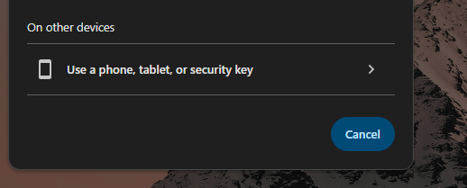
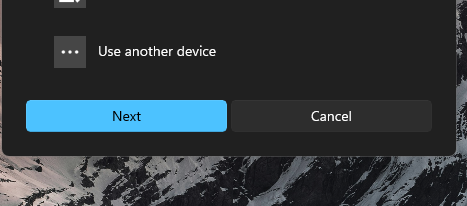

## Configuring The Identity Manager
 

We are going to deploy an OIDC identity manager called PocketID.  It's very fast and easy to setup and manage. 
I started by deploying Docker using our Ansible playbook on this new machine. Then I added a DNS entry for identity.dev.th3redc0rner.com on our DNS box and pointed it to our reverse proxy — this lets the proxy serve the site over TLS.


```css
192.168.200.226 identity.dev.th3redc0rner.com
```

Then we we restart dnsmasq
```css
systemctl restart dnsmasq
```

PocketID requires running over TLS so i made the following entry in our Caddy reverse proxy.  The config file should now look something similar to this.  This was in the Caddyfile in our reverse proxy setup.  This is getting our wildcard certs from Let's Encrypt and using Cloudflare to verify them.  

```css
*.dev.th3redc0rner.com {
        tls {
                dns cloudflare {env.CF_API_TOKEN}
                propagation_delay 2m
                resolvers 1.1.1.1
        }


        @identity host identity.dev.th3redc0rner.com
        handle @identity {
                reverse_proxy 192.168.201.75:1411
        }

       
}

```

Now on the identity machine we are going to setup our docker compose file.
First we are going to make the directory for everything.


```css
mkdir pocketid
```
Then we are going to grab the necessary files
```
 curl -O https://raw.githubusercontent.com/pocket-id/pocket-id/main/docker-compose.yml

 curl -o .env https://raw.githubusercontent.com/pocket-id/pocket-id/main/.env.example
```
We are then going to edit the file .env to make our identity uri match the variable
```css
# See the documentation for more information: https://pocket-id.org/docs/configuration/environment-variables
APP_URL=https://identity.dev.th3redc0rner.com
TRUST_PROXY=true
MAXMIND_LICENSE_KEY=
PUID=1000
PGID=1000
```

The docker compose file should be the same as the one we had downloaded.


```css
services:
  pocket-id:
    image: ghcr.io/pocket-id/pocket-id:v1
    restart: unless-stopped
    env_file: .env
    ports:
      - 1411:1411
    volumes:
      - "./data:/app/data"
    # Optional healthcheck
    healthcheck:
      test: [ "CMD", "/app/pocket-id", "healthcheck" ]
      interval: 1m30s
      timeout: 5s
      retries: 2
      start_period: 10s

```
In my setup the port 1411 is not exposed to anything but its local vlan.  The reverse proxy port 443 is only port being exposed on port 443 with TLS encryption due to ACL's on my VLANs. 


Finally if everything is correct you should be able to access the PocketID site.

To create your admin user visit this url.

`
https://<your-app-url>/setup
`  

One will get a warning screen similar to this.


Following this you should get a screen similar to this without a passkey already installed


You have to then add a passkey.  The way I have been doing it I then select "Use Another Device"


It will then let you choose to use your iphone or android device by using a QR code.  


Click Next and you should get a QR code generated


Scan that QR code and now your/ phone is acting as your password-less verification.  


Now that we have completed this task one should be able to logout return the home page of PocketID and you will be presented with a screen similar to this.


Once you click Authenticate you will be presented with either you single user or an option to use another device.

If you choose "On Other Device"

One can then login with QR Code.



At this point you can choose 
Use Another Device"

Once again you should be presented with the similar dialog with using a QR Code


Choose Iphone, Ipad or Android Device

A QR Code will be presented, if scanned one should now be authenticated as their admin user
---
Next entry we will actually be setting up GitTea now that all the backend infrastructure for it is in place
---

